## Hello, I'm Treloso

  
  

### What I can do:

- Build web pages with React

- Structure code with TypeScript

- Build back-end archtecture with Express and Node.js

- Develop VS Code extensions

- Write unit tests with Node.js and Vitest

- Work with Canvas for 2D rendering

### What I'm working on:

- [MyDeltabuddies](https://github.com/trelosoke/my-deltabuddies) — VS Code desktop pet extension with Deltarune characters

- [CallAlly](https://github.com/trelosoke/call-ally) — Ticket management system for daily tasks and issues

- [Da Guayaba](https://github.com/trelosoke/da-guayaba) — C++ audio synth

## 🛠️ Technologies I work with

### Front-End

  
  
  
  
  
  

### Backend

  
  
  
  
  

### Tools & Platforms

    
  
  
  

  

## 🌐 Social

<!--
**trelosoke/trelosoke** is a ✨ _special_ ✨ repository because its `README.md` (this file) appears on your GitHub profile.

Here are some ideas to get you started:

- 🔭 I’m currently working on ...
- 🌱 I’m currently learning ...
- 👯 I’m looking to collaborate on ...
- 🤔 I’m looking for help with ...
- 💬 Ask me about ...
- 📫 How to reach me: ...
- 😄 Pronouns: ...
- ⚡ Fun fact: ...
-->
